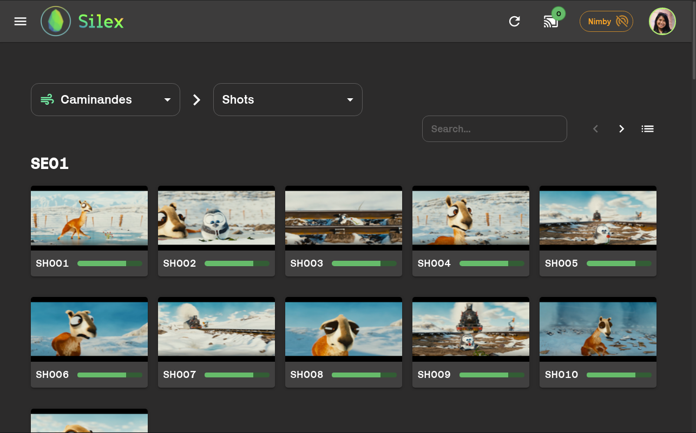

<h1 align="center">Silex front</h1>

       

<br>

<p align="center">
  
  <br><br>
  Front-end application of the Silex pipeline<br>
  <small>(Images: Blender Foundation)</small>
</p>

<br>

## Introduction

This project is built upon [React](https://reactjs.org/) / [TypeScript](https://www.typescriptlang.org/) and [Material UI](https://mui.com/) and talks with the CGWire [Zou](https://zou.cg-wire.com/) API with [GraphQL](https://graphql.org/) in order to display and interact with the production data, launch dccs and manage scene versions.

We didn't want to rely on classical Qt interfaces in Python integrated in Houdini or Maya but leverage the power of the web through a user friendly and powerful frontend application.

## Installation

The package manager used is [Yarn](https://yarnpkg.com/). Clone the repository and install the dependencies:

```bash
$ git clone https://github.com/ArtFXDev/silex-front
$ cd silex-front
$ yarn install # Install the dependencies
```

## Usage

### Environment variables

Before starting the UI, copy the [`.env.example`](.env.example) file to `.env` and configure the following variables:

They are:

- `VITE_ZOU_API` - the url of the Zou server (like `http://my-zou-server`). It's the same URL as the Kitsu app (since they are behind a Nginx proxy).

- `VITE_WS_SERVER` - the url of the Silex websocket service running on the client machine (open on the port `5118`).

- `VITE_TRACTOR_URL` - url of the Tractor interface

- `VITE_TRACTOR_BLADE` - the url of the Pixar Tractor Blade service running on the computer.

- `VITE_TRACTOR_LOG_URL` - Tractor log retrieval url (see: https://rmanwiki.pixar.com/display/TRA/Logging)

- `VITE_TICKET_URL` - URL of the Ticket system (we currently use [Zammad](https://zammad.com/))

- `VITE_HARVEST_URL` - URL of [Harvest](https://github.com/artFXDev/harvest-ui), the render farm monitoring UI (deprecated)

### Available scripts

The build system is [Vite](https://vitejs.dev/guide/#overview), it's a faster alternative than CRA (Create React App) / Webpack.

- 🚀 `yarn dev` -> runs the [Vite](https://vitejs.dev/guide/#overview) development server with HMR (hot module replacement)

- 👷 `yarn build` -> builds and bundle the whole app in a `dist` folder. It is used to bundle the code into static files meant to be hosted on a web server like Nginx or Apache.

- 🔨 `yarn tsc` -> runs the TypeScript compiler and report errors. Add `:watch` to run an interactive process that watches file changes.

- 💅 `yarn prettify` -> prettify the code with Prettier. Add `:write` to write the modifications.

- 🚨 `yarn lint` -> shows ESLint warnings and errors. Add `:fix` to apply auto fixes.

## ⚠️ Issues

Currently, Silex uses the Zou API to authenticate the user against the database. For that we make a request to `/api/auth/login` and we receive headers with the [Set-Cookie](https://developer.mozilla.org/en-US/docs/Web/HTTP/Headers/Set-Cookie) directive so that the token is sent again on future requests.

Recently the standards changed for the [`SameSite`](https://developer.mozilla.org/en-US/docs/Web/HTTP/Headers/Set-Cookie/SameSite) attribute for cookies which restrict the usage to a first-party or same site context.

Previously if the `SameSite` value wasn't provided (it was not the case for Zou, see [this](https://github.com/cgwire/zou/issues/385)) cookies were sent all the time. This is the behavior of Electron and [our desktop app](https://github.com/ArtFXDev/silex-desktop) is concerned.

Since the Zou API is hosted on a different domain name than Silex, cookies must now have the `SameSite=None` value with the `Secure` attribute which allows the usage of the cookie on another domain but forces HTTPS which may not be ideal...

It also constrain the local development of the front-end since you need to setup https locally. Hopefully you can disable it in [Firefox](https://stackoverflow.com/questions/65130753/disable-samesite-cookie-policy-in-firefox-developer-edition) or [Chrome](https://stackoverflow.com/questions/59030096/how-to-disable-same-site-policy-in-chrome).

## Libraries

Here are the main libraries and packages used:

| Library                                                            | Version  |
| ------------------------------------------------------------------ | -------- |
| [Material UI](https://mui.com/)                                    | `5.13.1` |
| [React](https://reactjs.org/)                                      | `18.2.0` |
| [TypeScript](https://www.typescriptlang.org/)                      | `5.0.4`  |
| [socket.io-client](https://socket.io/)                             | `4.6.1`  |
| [React router](reactrouter.com/)                                   | `6.11.2` |
| [Apollo Client (React)](https://www.apollographql.com/docs/react/) | `3.7.14` |

## Special thanks

- [Karrik](http://karrik.phantom-foundry.com/) is a libre font created by Jean-Baptiste Morizot et Lucas Le Bihan. It is licensed under the [SIL Open Font License](http://scripts.sil.org/OFL), Version 1.1.

## Contributing

Pull requests and issues are welcome. For major changes, please open an issue first to discuss what you would like to change.

✨ This project uses the [Conventional Commits](https://www.conventionalcommits.org/en/v1.0.0/) convention for commit messages. They are checked automatically with a git hook (thanks to [Husky](https://typicode.github.io/husky/#/) and [commitlint](https://github.com/conventional-changelog/commitlint)).

✅ There is also a `pre-commit` hook that will check and format your staged files with ESLint and Prettier. (thanks to [lint-staged](https://github.com/okonet/lint-staged))

## License

[MIT](./LICENSE.md) [@ArtFX](https://artfx.school/)
